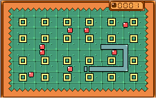

# Wondersnake
Snake game for Wonderswan Color Console
## Tech Infos
* Wonderswan Color
* NEC V30MZ 16 bit CPU (80186 compatible) 
* Pure assembler code
## Screenshot

## Build instruction
* Compiler: Borland Turbo Assembler  Version 3.1
* Linker: Borland Turbo Link  Version 5.1
* Use com2ws tool (source code included) to build Wondermagic-compatible cartridge image

## Authors
* **Tomasz Słanina** - [dox](https://github.com/tslanina)
## License
(c) 2007 - 2017 Tomasz Słanina
This project is licensed under the GPL v3 License - see the [LICENSE.md](LICENSE.md) file for details
